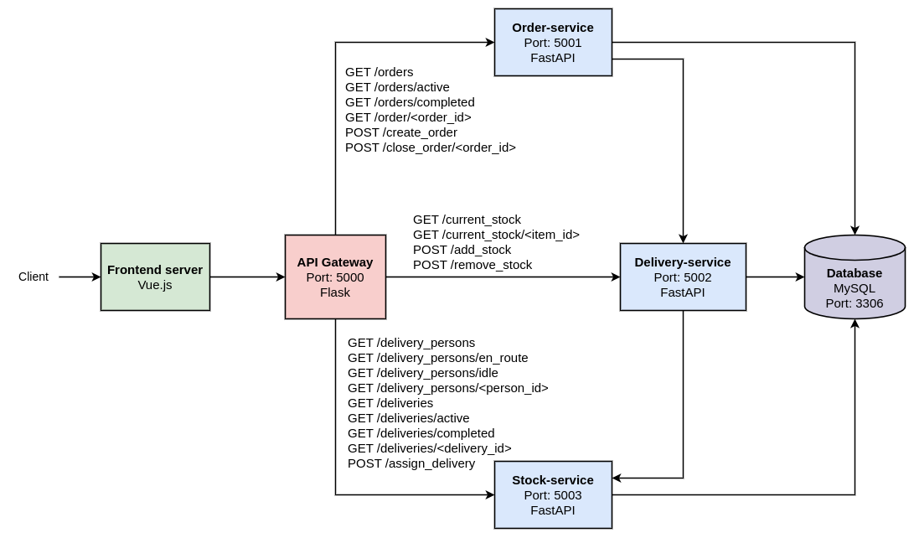
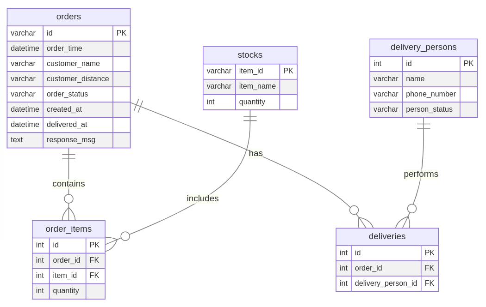

# Food Delivery Simulation App

## Overview

This project simulates a fast delivery network that runs on a microservices architecture. Orders can be created manually or generated automatically, validated against current inventory, assigned to drivers, delivered through an asynchronous workflow, and tracked through dashboards and historical metrics. The end-to-end flow now looks like this:

1. **Order Intake & Simulation Control** – Orders arrive either from the frontend or from the Order Auto Generation Service, which continuously creates randomized payloads while respecting user-defined intervals stored in Redis.
2. **Stock Validation & Reservation** – The Stock Service validates requested items, ensures quantities are available, and reserves inventory before fulfillment. Failed validations automatically cancel and annotate the order.
3. **Queued Fulfillment Tasks** – The Order Service enqueues Celery jobs handled by the Task Service. These jobs orchestrate stock updates, delivery assignment, and status messaging without blocking API threads.
4. **Delivery Simulation** – The Delivery Service tracks personnel states, and the Task Service simulates transit and completion times based on customer distance, updating both the order and delivery records.
5. **Metrics Collection** – The Metrics Service polls the Order Service, persists time-series data in InfluxDB, and exposes aggregated views for dashboards.
6. **Feedback & Reset** – Completed deliveries update personnel back to `idle`, making them available for the next assignment while the frontend refreshes automatically via the API Gateway.

## Architecture

### Microservices

1. **API Gateway**
   - Single entry point that proxies requests to every backend service.
   - Applies rate limiting, CORS, and request logging.
   - Surfaces aggregated routes for orders, deliveries, stock operations, metrics, and simulation controls.

2. **Order Service**
   - Owns order lifecycles, status transitions, and order_items persistence in MySQL.
   - Publishes Celery tasks for downstream stock validation and delivery simulation.
   - Provides rich querying for all, active, completed, and individual orders.

3. **Delivery Service**
   - Manages delivery_persons and deliveries tables, including state transitions between `idle` and `en_route`.
   - Offers APIs to inspect personnel availability, active deliveries, historical deliveries, and delivery-to-order mappings.

4. **Stock Service**
   - Tracks menu inventory, enforces max quantities, and exposes validation, add, remove, and lookup operations.
   - Automatically decrements stock as part of the async fulfillment flow.

5. **Task Service**
   - Celery worker that consumes jobs from Redis and coordinates between Order, Delivery, and Stock Services.
   - Retries transient failures with exponential backoff and simulates realistic delivery durations.

6. **Order Auto Generation Service**
   - FastAPI application that keeps a background thread running to create random orders using Faker data.
   - Provides endpoints to start/stop the simulation and adjust generation intervals persisted in Redis.

7. **Metrics Service**
   - Polls the Order Service every few seconds, writes time-series points to InfluxDB, and exposes REST endpoints for historical and current active-order counts.
   - Powers the dashboard charts rendered in the frontend.

8. **Frontend Service**
   - Vue 3 SPA that surfaces dashboards for orders, deliveries, personnel, stock, metrics, and simulation controls.
   - Proxies API calls through `/api`, enabling local dev or Docker-based deployments.

### Database

- **MySQL**: Authoritative data store for orders, deliveries, personnel, and stock. Seeded via `database/init.sql` and extended with migrations.
- **Redis**: Backing store for Celery queues, task results, and simulation control flags such as interval ranges and on/off state.
- **InfluxDB 2.x**: Time-series storage for active-order metrics consumed by the Metrics Service and dashboard visualizations.

### Deployment

- **Docker**: Each service, worker, and datastore ships with its own Dockerfile.
- **Docker Compose**: `docker-compose.yml` wires networks, volumes, health dependencies, and exposes ports: API Gateway (5000), services (5001-5006), MySQL (5004), Redis (6379), InfluxDB (8086), and the Vue frontend (8080).

## Getting Started

### Prerequisites

- Docker 24+
- Docker Compose v2
- Node.js 18+ (only required for direct frontend development outside Docker)

### Installation

1. Clone the repository:

   ```bash
   git clone https://github.com/sandeepgit32/fast-delivery-app-simulation-microservices.git
   cd fast-delivery-app-simulation-microservices
   ```

2. Copy the default environment files and adjust values as needed:

   ```bash
   cp order-service/.env.example order-service/.env
   cp delivery-service/.env.example delivery-service/.env
   cp stock-service/.env.example stock-service/.env
   cp tasks/.env.example tasks/.env
   cp order-auto-generation-service/.env.example order-auto-generation-service/.env
   cp influxdb/.env.example influxdb/.env
   # metrics-service already includes a .env file; align its token with influxdb/.env
   ```

3. Build and start the full stack:

   ```bash
   docker compose up --build
   ```

4. Access the services:
   - Frontend dashboard: `http://localhost:8080`
   - API Gateway (direct API calls): `http://localhost:5000`
   - InfluxDB UI: `http://localhost:8086`
   - MySQL: `localhost:5004` (mapped to container `db:3306`)

### Environment Variables

| Service | File | Notable variables |
| --- | --- | --- |
| Order / Delivery / Stock Services | `.env` | `DB_*` credentials plus `TASK_QUEUE_*` connection strings to Redis |
| Task Service | `tasks/.env` | Queue names, Redis broker/backend URLs, and internal service URLs |
| Order Auto Generation Service | `order-auto-generation-service/.env` | `ORDER_INTERVAL_MIN/MAX`, service URLs, and Redis connection |
| Metrics Service | `metrics-service/.env` | `INFLUXDB_URL`, `INFLUXDB_TOKEN`, org/bucket, polling interval, Order Service URL |
| InfluxDB | `influxdb/.env` | Bootstrap admin credentials, token, org, and bucket used by metrics |
| Frontend | `frontend-service/.env` (optional) | Override `VUE_APP_API_URL` when running outside Docker |

## Services

#### API Gateway

- **Port**: 5000
- **Endpoints**:
  - Orders: `GET /orders`, `GET /orders/active`, `GET /orders/completed`, `GET /order/{order_id}`, `POST /create_order`, `POST /close_order/{order_id}`, `POST /cancel_order/{order_id}`, `POST /update_msg/{order_id}`
  - Delivery personnel: `GET /delivery_persons`, `GET /delivery_persons/en_route`, `GET /delivery_persons/idle`, `GET /delivery_persons/{person_id}`, `POST /update_delivery_person_status/{person_id}`
  - Deliveries: `GET /deliveries`, `GET /deliveries/active`, `GET /deliveries/completed`, `GET /deliveries/{delivery_id}`, `GET /deliveries/by_order/{order_id}`, `POST /assign_delivery`
  - Stock: `GET /current_stock`, `GET /current_stock/{item_id}`, `POST /add_stock`, `POST /remove_stock`, `POST /validate_stock`
  - Metrics: `GET /metrics/active-orders?range=15m`, `GET /metrics/active-orders/current`
  - Simulation controls: `GET /order_start`, `GET /order_stop`, `GET /get_order_interval`, `POST /set_order_interval`

#### Order Service

- **Port**: 5001
- **Endpoints**:
  - `POST /create_order`
  - `POST /close_order/{order_id}`
  - `POST /cancel_order/{order_id}`
  - `POST /update_msg/{order_id}`
  - `GET /orders`
  - `GET /orders/active`
  - `GET /orders/completed`
  - `GET /order/{order_id}`

#### Delivery Service

- **Port**: 5002
- **Endpoints**:
  - `GET /delivery_persons`
  - `GET /delivery_persons/en_route`
  - `GET /delivery_persons/idle`
  - `GET /delivery_persons/{person_id}`
  - `GET /deliveries`
  - `GET /deliveries/active`
  - `GET /deliveries/completed`
  - `GET /deliveries/{delivery_id}`
  - `GET /deliveries/by_order/{order_id}`
  - `POST /assign_delivery`
  - `POST /update_delivery_person_status`
  - `POST /create_delivery_record`

#### Stock Service

- **Port**: 5003
- **Endpoints**:
  - `POST /add_stock`
  - `POST /remove_stock`
  - `POST /validate_stock`
  - `GET /current_stock`
  - `GET /current_stock/{item_id}`

#### Order Auto Generation Service

- **Port**: 5005
- **Endpoints**:
  - `GET /order_start` – enable automatic order creation
  - `GET /order_stop` – halt generation
  - `GET /get_order_interval` – inspect current status and min/max intervals
  - `POST /set_order_interval` – update generation cadence

#### Metrics Service

- **Port**: 5006
- **Endpoints**:
  - `GET /` – service status
  - `GET /health` – readiness probe
  - `GET /metrics/active-orders` – historical counts for a specified range (15m–24h)
  - `GET /metrics/active-orders/current` – latest active-order snapshot

#### Task Service

- **Worker**: Celery app named by `TASK_QUEUE_NAME`, no HTTP port exposed.
- **Responsibilities**:
  - Validate stock, update order messages, and adjust quantities atomically across services.
  - Assign delivery personnel, simulate travel time, and close orders.
  - Retry transient failures with exponential backoff using Tenacity.

#### Frontend Service

- **Port**: 8080
- **Features**:
  - Dashboard cards for key KPIs (active/completed orders, driver availability, stock health).
  - Management views for orders, deliveries, delivery personnel, and stock adjustments.
  - Real-time charts powered by Metrics Service data and controls for the auto-generation simulator.

## Configuration

#### MySQL

- **User**: `root`
- **Password**: `password`
- **Database**: `food_delivery`
- Exposed on host port `5004`; data persisted via the `mysql-data` volume.

#### Redis

- **Port**: `6379`
- Used by Celery (broker + backend) and by the auto-generation control flags.

#### InfluxDB

- **Port**: `8086`
- Seeded through `influxdb/.env`; ensure the admin token matches `metrics-service/.env`.
- Stores `active_orders` measurement with `count` field and `service` tag.

## File Structure

```
fast-delivery-simulation-app/
├── api-gateway/
│   ├── app.py
│   ├── Dockerfile
│   └── requirements.txt
├── architecture.drawio
├── architecture.drawio.png
├── database/
│   ├── Dockerfile
│   ├── init.sql
│   └── migrations/
├── delivery-service/
│   ├── api_documentation.md
│   ├── app.py
│   └── test_api.py
├── order-service/
│   ├── api_documentation.md
│   ├── app.py
│   └── test_api.py
├── stock-service/
│   ├── api_documentation.md
│   ├── app.py
│   └── test_api.py
├── tasks/
│   ├── tasks.py
│   └── requirements.txt
├── order-auto-generation-service/
│   ├── app.py
│   └── requirements.txt
├── metrics-service/
│   ├── api_documentation.md
│   ├── app.py
│   └── requirements.txt
├── frontend-service/
│   ├── src/
│   │   ├── App.vue
│   │   ├── main.js
│   │   └── components/
│   ├── public/
│   │   └── index.html
│   ├── package.json
│   └── vue.config.js
├── influxdb/
│   └── Dockerfile
├── redis/
│   └── config/
│       └── redis.conf
├── docker-compose.yml
├── schema.mmd
└── README.md
```

### Microservices Architecture



### Database Schema



## Testing

Run the API test suites for the core services:

```bash
pytest order-service/test_api.py
pytest delivery-service/test_api.py
pytest stock-service/test_api.py
```

## Contributing

Contributions are welcome! Please open an issue or submit a pull request for any improvements or bug fixes.

## License

This project is licensed under the MIT License.
